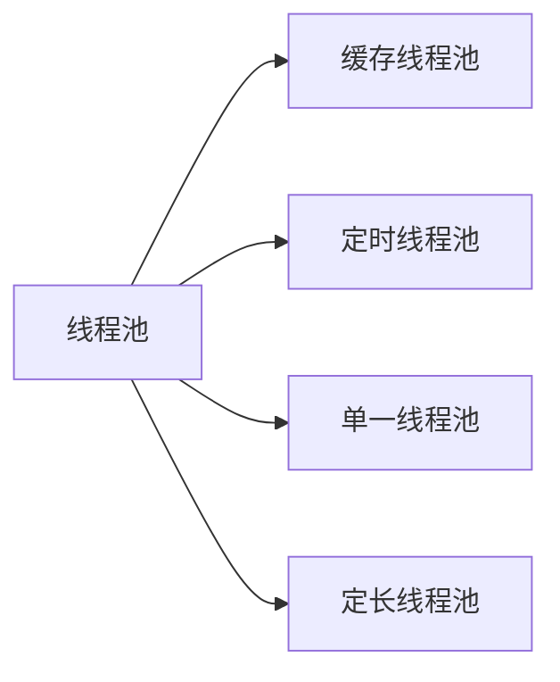
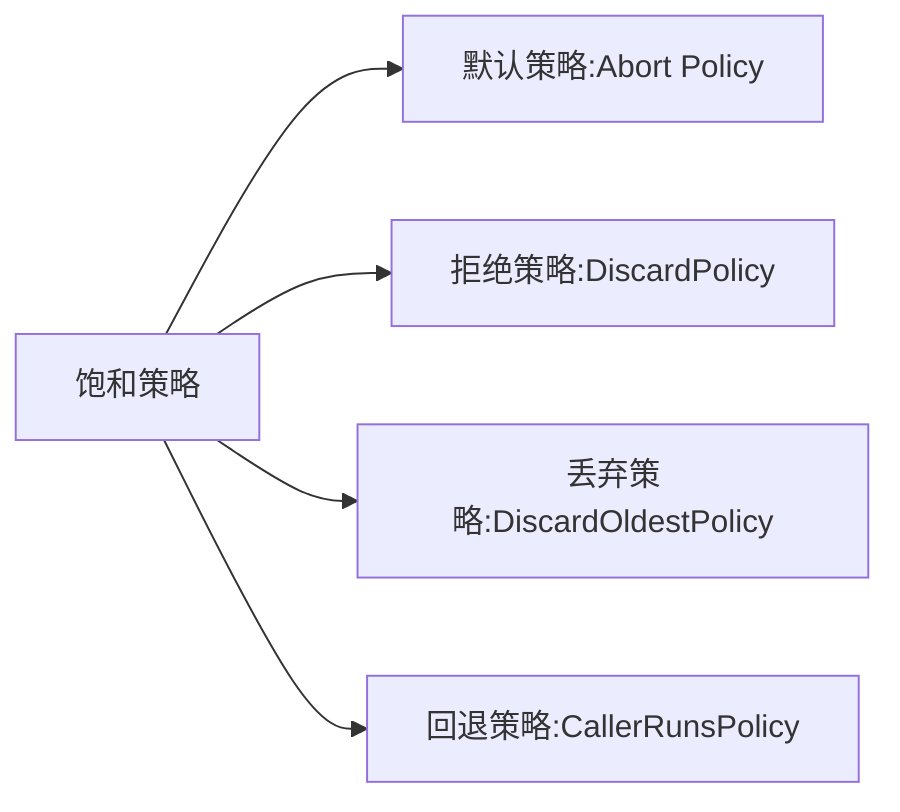

#### 为什么要有线程池

###### 线程的创建和销毁为什么会消耗性能呢？

- 线程的创建和运行是从用户态切换到核心态的过程，这个过程比较耗时，损耗性能

- 线程的创建需要在我们去开辟虚拟机栈，本地方法栈，程序计数器等线程私有的内存空间。当线程销毁的时候需要回收这些资源，频繁的创建和回收会浪费系统的资源。

- 为了让创建的线程能重复利用起来，我们可以通过线程池来管理和协调线程的工作。

###### 线程池的好处我的理解是如下两个

- 可以有效控制最大的并发数，提供很好的性能

- 可以重复利用线程池的中线程，有效的管理和协调线程间的工作

#### 线程池的体系

如图


#### 线程池的创建

> Java为我们提供了一个线程工厂类-Executors，内部提供了众多静态方法来创建线程池

###### newSingleThreadExecutor

> 创建一个线程的线程池，保证了提交的任务有序的执行，按照先进先出的顺序来执行任务。

代码实操

```kotlin
 var contentView = DataBindingUtil.setContentView<ActivityMainBinding>(this, R.layout.activity_main)
        contentView.btnSingleThread.setOnClickListener { listener ->
            var newSingleThreadExecutor = Executors.newSingleThreadExecutor()
            for (index in 0..5) {
                val flags = index
                newSingleThreadExecutor.submit(Runnable {
                    println("线程 ${Thread.currentThread().name} --- $flags")
                })
                Thread.sleep(100)
            }
        }
```

结果运行

```xml-dtd
2020-04-28 22:36:17.760 11476-11576/com.dashingqi.threadproject I/System.out: 线程 pool-1-thread-1 --- 0
2020-04-28 22:36:17.860 11476-11576/com.dashingqi.threadproject I/System.out: 线程 pool-1-thread-1 --- 1
2020-04-28 22:36:17.962 11476-11576/com.dashingqi.threadproject I/System.out: 线程 pool-1-thread-1 --- 2
2020-04-28 22:36:18.063 11476-11576/com.dashingqi.threadproject I/System.out: 线程 pool-1-thread-1 --- 3
2020-04-28 22:36:18.165 11476-11576/com.dashingqi.threadproject I/System.out: 线程 pool-1-thread-1 --- 4
2020-04-28 22:36:18.267 11476-11576/com.dashingqi.threadproject I/System.out: 线程 pool-1-thread-1 --- 5
```

###### newCachedThreadPool

> 创建一个可缓存线程池，如果线程池中线程数量超过要处理的任务，可灵活回收空闲线程，如果没有可回收，针对新的任务就创建新的线程去执行该任务。

代码实操

```kotlin
 contentView.btnNewCacheThread.setOnClickListener { view ->
            var newCachedThreadPool = Executors.newCachedThreadPool()
            for (index in 0..5) {
                val flags = index
                newCachedThreadPool.submit(Runnable {
                    println("线程 === ${Thread.currentThread().name} task == $flags")
                    Thread.sleep(500)
                })


            }
            newCachedThreadPool.shutdown()
        }
```

运行结果

```xml-dtd
2020-04-28 22:54:32.287 12074-12138/com.dashingqi.threadproject I/System.out: 线程 === pool-1-thread-1 task == 0
2020-04-28 22:54:32.287 12074-12139/com.dashingqi.threadproject I/System.out: 线程 === pool-1-thread-2 task == 1
2020-04-28 22:54:32.288 12074-12141/com.dashingqi.threadproject I/System.out: 线程 === pool-1-thread-4 task == 3
2020-04-28 22:54:32.288 12074-12140/com.dashingqi.threadproject I/System.out: 线程 === pool-1-thread-3 task == 2
2020-04-28 22:54:32.288 12074-12142/com.dashingqi.threadproject I/System.out: 线程 === pool-1-thread-5 task == 4
2020-04-28 22:54:32.289 12074-12143/com.dashingqi.threadproject I/System.out: 线程 === pool-1-thread-6 task == 5
```

我们可以发现创建了6个线程去执行提交的任务

如果我们在每次任务提交之后，在主线程中睡个1秒钟，看下效果

```kotlin
 contentView.btnNewCacheThread.setOnClickListener { view ->
            var newCachedThreadPool = Executors.newCachedThreadPool()
            for (index in 0..5) {
                val flags = index
                newCachedThreadPool.submit(Runnable {
                    println("线程 === ${Thread.currentThread().name} task == $flags")							//提交的任务执行了500多秒钟后，线程处于空闲状态了
                  	//当下一个任务提交后，又交由该线程来执行，所以你看运行结果会发现都是一个线程在操作
                    Thread.sleep(500)
                })
              	//提交任务后我们让主线程睡了1秒钟
                Thread.sleep(1000)
            }
            newCachedThreadPool.shutdown()
        }
```

运行结果

```xml-dtd
2020-04-28 23:00:10.968 12300-12425/com.dashingqi.threadproject I/System.out: 线程 === pool-1-thread-1 task == 0
2020-04-28 23:00:11.969 12300-12425/com.dashingqi.threadproject I/System.out: 线程 === pool-1-thread-1 task == 1
2020-04-28 23:00:12.970 12300-12425/com.dashingqi.threadproject I/System.out: 线程 === pool-1-thread-1 task == 2
2020-04-28 23:00:13.971 12300-12425/com.dashingqi.threadproject I/System.out: 线程 === pool-1-thread-1 task == 3
2020-04-28 23:00:14.972 12300-12425/com.dashingqi.threadproject I/System.out: 线程 === pool-1-thread-1 task == 4
2020-04-28 23:00:15.974 12300-12425/com.dashingqi.threadproject I/System.out: 线程 === pool-1-thread-1 task == 5
```

###### newFixedThreadPool

> 创建一个固定数量的线程池，提交的任务都交由创建的线程来执行，创建的线程可重用的

代码实操

```kotlin
 contentView.btnFixedThread.setOnClickListener { view ->
            //创建了一个3个线程的线程池
            var newFixedThreadPool = Executors.newFixedThreadPool(3)
            for (index in 0..10) {
                val flags = index
                newFixedThreadPool.submit(Runnable {
                    println("线程 === ${Thread.currentThread().name} task == $flags")
                })
            }
        }
```

运行结果

```xml-dtd
2020-04-28 23:13:00.513 12950-13015/com.dashingqi.threadproject I/System.out: 线程 === pool-1-thread-1 task == 0
2020-04-28 23:13:00.514 12950-13016/com.dashingqi.threadproject I/System.out: 线程 === pool-1-thread-2 task == 1
2020-04-28 23:13:00.514 12950-13015/com.dashingqi.threadproject I/System.out: 线程 === pool-1-thread-1 task == 3
2020-04-28 23:13:00.514 12950-13016/com.dashingqi.threadproject I/System.out: 线程 === pool-1-thread-2 task == 4
2020-04-28 23:13:00.514 12950-13015/com.dashingqi.threadproject I/System.out: 线程 === pool-1-thread-1 task == 5
2020-04-28 23:13:00.514 12950-13016/com.dashingqi.threadproject I/System.out: 线程 === pool-1-thread-2 task == 6
2020-04-28 23:13:00.514 12950-13015/com.dashingqi.threadproject I/System.out: 线程 === pool-1-thread-1 task == 7
2020-04-28 23:13:00.515 12950-13016/com.dashingqi.threadproject I/System.out: 线程 === pool-1-thread-2 task == 8
2020-04-28 23:13:00.515 12950-13015/com.dashingqi.threadproject I/System.out: 线程 === pool-1-thread-1 task == 9
2020-04-28 23:13:00.515 12950-13015/com.dashingqi.threadproject I/System.out: 线程 === pool-1-thread-1 task == 10
2020-04-28 23:13:00.517 12950-13017/com.dashingqi.threadproject I/System.out: 线程 === pool-1-thread-3 task == 2
```

###### newScheduledThreadPool

> 创建一个定时线程池，支持定时以及周期型的执行任务

代码实操

```kotlin
 contentView.btnScheduledThread.setOnClickListener { view ->
            var newScheduledThreadPool = Executors.newScheduledThreadPool(3)
            //延迟500毫秒执行，在每隔500毫秒执行一次
            newScheduledThreadPool.scheduleAtFixedRate(Runnable {
                var date = Date()
                println("线程 === ${Thread.currentThread().name} time == $date")
            }, 500, 500, TimeUnit.MILLISECONDS)

            //当执行10秒钟后，就终止任务的执行
            contentView.btnScheduledThread.postDelayed(Runnable { newScheduledThreadPool.shutdownNow() }, 10000)

        }
```

运行结果

```xml-dtd
2020-04-28 23:25:07.853 13238-13319/com.dashingqi.threadproject I/System.out: 线程 === pool-1-thread-1 time == Tue Apr 28 23:25:07 GMT+08:00 2020
2020-04-28 23:25:08.124 13238-13319/com.dashingqi.threadproject I/System.out: 线程 === pool-1-thread-1 time == Tue Apr 28 23:25:08 GMT+08:00 2020
2020-04-28 23:25:08.622 13238-13320/com.dashingqi.threadproject I/System.out: 线程 === pool-1-thread-2 time == Tue Apr 28 23:25:08 GMT+08:00 2020
2020-04-28 23:25:09.124 13238-13320/com.dashingqi.threadproject I/System.out: 线程 === pool-1-thread-2 time == Tue Apr 28 23:25:09 GMT+08:00 2020
2020-04-28 23:25:09.624 13238-13320/com.dashingqi.threadproject I/System.out: 线程 === pool-1-thread-2 time == Tue Apr 28 23:25:09 GMT+08:00 2020
2020-04-28 23:25:10.124 13238-13320/com.dashingqi.threadproject I/System.out: 线程 === pool-1-thread-2 time == Tue Apr 28 23:25:10 GMT+08:00 2020
2020-04-28 23:25:10.623 13238-13321/com.dashingqi.threadproject I/System.out: 线程 === pool-1-thread-3 time == Tue Apr 28 23:25:10 GMT+08:00 2020
2020-04-28 23:25:11.124 13238-13321/com.dashingqi.threadproject I/System.out: 线程 === pool-1-thread-3 time == Tue Apr 28 23:25:11 GMT+08:00 2020
2020-04-28 23:25:11.625 13238-13321/com.dashingqi.threadproject I/System.out: 线程 === pool-1-thread-3 time == Tue Apr 28 23:25:11 GMT+08:00 2020
2020-04-28 23:25:12.124 13238-13321/com.dashingqi.threadproject I/System.out: 线程 === pool-1-thread-3 time == Tue Apr 28 23:25:12 GMT+08:00 2020
2020-04-28 23:25:12.624 13238-13321/com.dashingqi.threadproject I/System.out: 线程 === pool-1-thread-3 time == Tue Apr 28 23:25:12 GMT+08:00 2020
2020-04-28 23:25:13.125 13238-13321/com.dashingqi.threadproject I/System.out: 线程 === pool-1-thread-3 time == Tue Apr 28 23:25:13 GMT+08:00 2020
2020-04-28 23:25:13.625 13238-13321/com.dashingqi.threadproject I/System.out: 线程 === pool-1-thread-3 time == Tue Apr 28 23:25:13 GMT+08:00 2020
2020-04-28 23:25:14.123 13238-13321/com.dashingqi.threadproject I/System.out: 线程 === pool-1-thread-3 time == Tue Apr 28 23:25:14 GMT+08:00 2020
2020-04-28 23:25:14.624 13238-13321/com.dashingqi.threadproject I/System.out: 线程 === pool-1-thread-3 time == Tue Apr 28 23:25:14 GMT+08:00 2020
2020-04-28 23:25:15.125 13238-13321/com.dashingqi.threadproject I/System.out: 线程 === pool-1-thread-3 time == Tue Apr 28 23:25:15 GMT+08:00 2020
2020-04-28 23:25:15.625 13238-13321/com.dashingqi.threadproject I/System.out: 线程 === pool-1-thread-3 time == Tue Apr 28 23:25:15 GMT+08:00 2020
2020-04-28 23:25:16.123 13238-13321/com.dashingqi.threadproject I/System.out: 线程 === pool-1-thread-3 time == Tue Apr 28 23:25:16 GMT+08:00 2020
2020-04-28 23:25:16.624 13238-13321/com.dashingqi.threadproject I/System.out: 线程 === pool-1-thread-3 time == Tue Apr 28 23:25:16 GMT+08:00 2020
2020-04-28 23:25:17.124 13238-13321/com.dashingqi.threadproject I/System.out: 线程 === pool-1-thread-3 time == Tue Apr 28 23:25:17 GMT+08:00 2020
```

#### 线程池的结构

###### 线程池状态

- 一个AtomicInteger类型，二进制高3位用来标识线程池的状态，低29位用来记录线程池中线程的数量

###### 状态

- RUNNING：默认状态，接受新任务并处理排队任务

- SHUTDOWN：不接受新任务，但是处理排队的任务，待用shutdown()会处于该状态

- STOP：不接受新任务，也不处理排队任务，并且终止正在运行的任务。待用shutdownNow()方法会处于该状态

- TIDYING：所有任务都终止，workerCount为零时，线程会转换到TIDYING状态，并将运行terminate()方法

- TERMINATED：terminate()运行完成后线程池转为此状态

###### worker集合

- 保存所有核心线程和非核心线程

- 它的本质是一个HashSet

###### 等待任务队列

- 当核心线程达到最大值的时候，新进来的任务会存放在这个等待任务队列中

- 它的本质就是一个阻塞队列（BlockingQueue）

#### 线程池构造函数参数

- corePoolSize：核心线程数量

- maximumPoolSize：最大线程数量

- keepAliveTime：线程池中线程空闲的时间

- unit：空闲时间的单位

- workQueue：等待队列，线程池中核心线程都在工作，新进来的任务将放在等待队列中

- threadFactory：线程工厂，用来创建线程

- handler：饱和策略。当等待线程满了，并且此时线程数达到了线程最大数，就会执行饱和策略。

#### 流程解析

- 当线程池中运行的线程数量没有达到核心线程数量的时候，当有新任务的时候，会创建一个新的线程去执行该任务，不管之前的线程是否处于空闲状态

- 当线程池中运行的线程数量已经到达核心线程的数量，之后提交的任务的会存放在等待队列中。直到某一个运行的线程空闲了，我们会按照等待队列规则拿到一个任务去交由这个线程去执行

- 当线程池中线程数达到了核心线程数，但是没有达到最大线程数，但是此时等待任务队列已经满了，那么会创建非核心线程去执行该任务。

- 提交的任务，无法被核心线程执行，也无法进入排序等待队列中，也无法被非核心线程执行，那么就会去去执行饱和策略去处理这个任务，如果我们没有提供饱和策略（RejectedExecutionHandler），这时会抛出RejectedExecutionException异常

#### 总结






